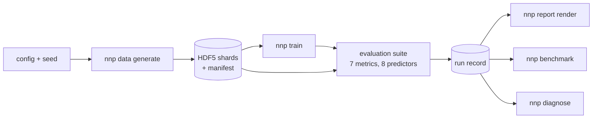

# neural-network-physics

Neural surrogates for two physical systems, gravitational N-body and 2D incompressible fluid
flow, with a system agnostic evaluation harness that measures where a surrogate can be
trusted rather than whether its test error is low. The harness scores error growth over long
rollouts, drift in conserved quantities, behaviour outside the training regime, respect for
symmetries, consistency under a change of resolution, calibration of the surrogate's own
uncertainty, and speedup at matched accuracy.

## The headline result

**On this machine no surrogate here is faster than the solver at matched accuracy.** That is
the question the repository exists to answer, and answering it honestly was the point.

| System | Surrogate | Beats persistence in distribution | Survives the held out regime | Speedup at matched accuracy | Warns before it fails |
|---|---|---|---|---|---|
| N-body | `graph` | yes, 6x lower one step error | no, all rollouts diverge | 0.056, range 0.043 to 0.107 | no, 0.088 too late |
| Fluid | `operator` | no | no, all rollouts diverge | 1.23, range 0.81 to 1.63 | yes, by 0.4 |
| Fluid | `convolution` | yes, 2x lower one step error | yes | not measured | not measured |

The one close case is the fluid operator, and a speedup whose range straddles one is not a
speedup. The one clear win is the convolutional control beating the neural operator it was
built to be a control for. Every number here is traceable to a run id in
[`docs/results.md`](docs/results.md).

## The pipeline



The run identifier is a hash of the resolved configuration and the seed, so the same inputs
give the same run. Nothing under `runs/` or `data/` is committed, because all of it is
generated.

## Getting started

```sh
uv sync
uv run nnp data generate --config configs/nbody.yaml   # 38 s
uv run nnp train         --config configs/nbody.yaml   # 1,328 s, 40 epochs
uv run nnp report render --run f68ffffd42abb2f4        # 6 s, 20 plots, one HTML file
uv run nnp report page                                 # 2 s, the landing page over every run
```

`serve.bat` builds that landing page and serves `runs/` on port 8000. It answers the
question at the top of this file for a reader who does not work on simulation, and every
number on it comes from a run record.

Timings are wall clock on the target machine, eight logical CPU cores and no CUDA.
[`docs/reproduction.md`](docs/reproduction.md) is the full path from a clean checkout to
every number in the results, about five and a half hours, with the runtime of each step.

Other entry points: `nnp data verify`, `nnp data stats`, `nnp eval run`, `nnp ensemble
train`, `nnp ensemble run`, `nnp benchmark`, `nnp report compare`, `nnp diagnose`.

## The code

```
src/nnphysics/
  core/       protocols, types, registry, config, seeding, errors, units
  systems/    nbody/, fluid/: dynamics, solvers, invariants, symmetries, regimes
  data/       generation, storage, manifests, splits, normalisation, verification
  models/     baselines, graph network, neural operator, convolutional control, ensemble
  training/   loop, curriculum, losses, schedules, checkpointing
  evals/      rollout drivers, metrics/, predictors/, speed benchmark
  reporting/  run records, document model, plots, Markdown and HTML render, comparison
  agent/      regression diagnosis, fault injection, scoring
  cli/        the nnp entry point
```

Dependencies point inwards only, and two tests parse the source to enforce it: nothing under
`evals` may import a system, a model or the training loop, and nothing under `agent` or
`reporting` may import the CLI. That is what lets one suite score a solver, a neural
operator and a broken baseline through the same interface.

[`docs/architecture.md`](docs/architecture.md) describes what was built, including the two
protocols the plan did not have and why the second system forced one of them.

## Limitations

Read these before the results.

**Small systems, small data, one machine.** 32 point masses in the N-body training regimes
and 4 in the held out one; a 64 by 64 periodic grid for the fluid. 192 and 96 trajectories,
31 MB and 128 MB. Every timing is from one eight core Windows laptop with no CUDA, and
absolute timings do not transfer.

**The horizons are short, and both surrogates stop being physical well inside them.**
Measured at a tenth of the state size, the N-body graph network is worth using for 3.75 of
its 255 stored steps and the fluid convolutional network for 11.5 of its 63. Past those the
error is larger than the signal.

**Neither surrogate generalises to its held out regime.** The N-body graph network diverges
on all four held out rollouts and the fluid operator on all four of its own. Only the fluid
convolutional network survives, and persistence still beats it there.

**Unphysical growth is real and an error curve hides it.** The convolutional network
reproduces the viscous decay of enstrophy almost exactly and still adds energy the physics
did not supply, standing up to 0.566 above the true value where the true dynamics move 0.234.

**Calibration can be bought with vagueness.** The fluid ensemble's useful 0.4 warning lead
comes with a stated spread 109 times the size of the true state. Sharpness is reported
beside every coverage number for that reason.

**Timings are not reproducible and neither is the third significant figure of a chaotic
error.** Benchmark timings drifted by a factor of two in one session. The same N-body weights
give a worst error of 2.143 on eight threads and 1.523 on one, because threading changes the
order the sums accumulate in.

**The diagnosis agent's 86 per cent was not produced by the shipped command.** No API
credential was available, so each context was answered by a separate Claude instance and
scored by the same code. The ranking is honest; the cost per diagnosis was not measured.

## Checks

```sh
uv run ruff check . && uv run ruff format --check .
uv run mypy
uv run pytest              # 1,399 tests, 102 s
uv run pytest -m ""        # adds slow and integration, 1,401 tests, 132 s
```

`ruff` and `mypy --strict` are clean over 207 source files, with two mypy overrides in
`pyproject.toml`, each carrying a one line reason. The full suite is 1,401 passed and 2
skipped, at 96 per cent branch coverage. Both skips are the live API tests, which need an
`ANTHROPIC_API_KEY`. CI runs lint, format, types and the fast suite on every push and pull
request.

Every metric has a sentinel test asserting both what it catches and what it does not,
because a metric that cannot fail is not a metric.

## Documents

- [`docs/results.md`](docs/results.md): every result, with the run id behind each number, the
  limitations, and what did not work.
- [`docs/architecture.md`](docs/architecture.md): what was built, and where it departed from
  the plan.
- [`docs/reproduction.md`](docs/reproduction.md): clean checkout to headline numbers, with
  runtimes.
- [`docs/results/diagnosis.md`](docs/results/diagnosis.md): the scored fault injection, per
  fault.
- [`docs/plan/`](docs/plan/): the eleven phase briefs the work was executed against.
